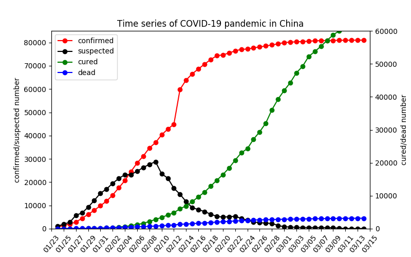

# 2019-nCov Visualizer

## Description

Novel Coronavirus 2019 ([2019-nCov](#1)) has been spread crazily in China even over the world since the end of 2019. Thousands of people were infected in less than one month. In order to closely monitor the outbreak and developing phase of this disease, this repo was created to give you some quicklooks of how it looks like in China NOW.

The raw data was collected by Chinese government and distributed by some well-known public platforms in China (e.g., [丁香园](#2)). The dataset used in the analysis was accessed through the [API](#3) provided by [BlanKerL](#5) (BIG thanks).

For those only interested in the csv-format data, you can turn to the [data repository](#4).

## Requirements

- Anaconda 3.5 (Python 3.x Version)

**Set up the environment**

```shell
conda create -n 2019_nCov
conda activate 2019_nCov
conda install python=3.6
pip install -r requirements.txt
```

## Results

<p align='center'>

<br>
<b>Time series of 2019-nCov patients in China</b>

Detailed results can be found in [2019-nCov-stats.md](docs/2019-coronavirus-stats.md)

## Contact

Zhenping Yin <zp.yin@whu.edu.cn>

[1]: https://www.cdc.gov/coronavirus/2019-ncov/index.html?CDC_AA_refVal=https%3A%2F%2Fwww.cdc.gov%2Fcoronavirus%2Fnovel-coronavirus-2019.html
[2]: http://www.dxy.cn/
[3]: https://lab.isaaclin.cn/nCoV/
[4]: https://github.com/BlankerL/DXY-2019-nCoV-Data
[5]: https://github.com/BlankerL