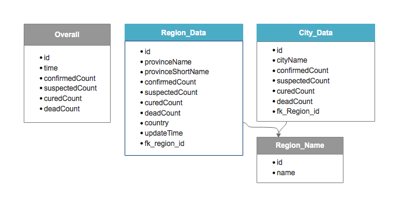
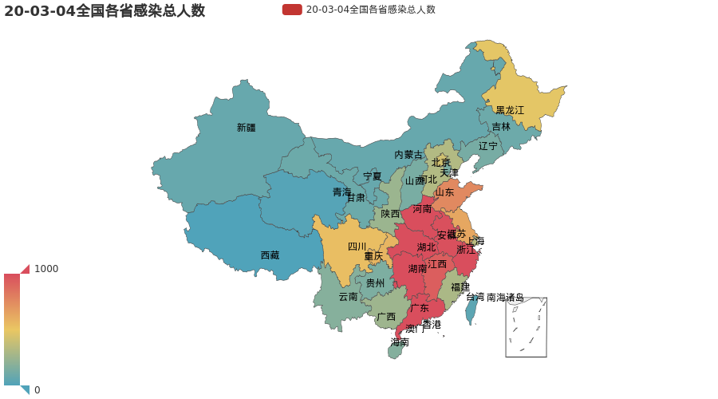
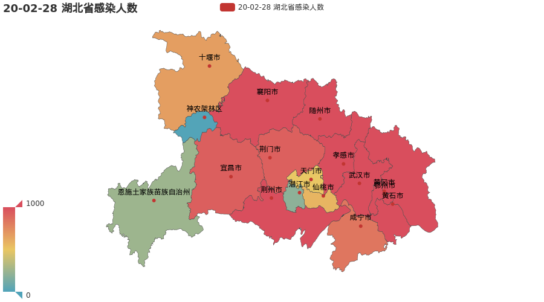

# 2019 Coronavirus Statistics

## Description

This project is aimed to guide myself through the whole process of how to create a standard project to demonstrate something useful for others.

## Project structure

`data_downloader`

1. download the data through the [API](#1) provided by someone anonymous. Here, I'm appreciated for the efforts that the anonymous author made to share the data.
2. save the data records to SQLite3 database, which is stored under the folder of `db`.

 
<b>database structure</b>

`data_visualizer`

1. display some statistics in a intuitive manner.

 
<b>Time series of 2019-nCov patients in China</b>

 
<b>Provincial distribution of 2019-nCov patients in China</b>

 
<b>Distribution of 2019-nCov patients in Hubei Province</b>

## Contact

- Zhenping Yin <zp.yin@whu.edu.cn>

[1]: https://lab.isaaclin.cn/nCoV/